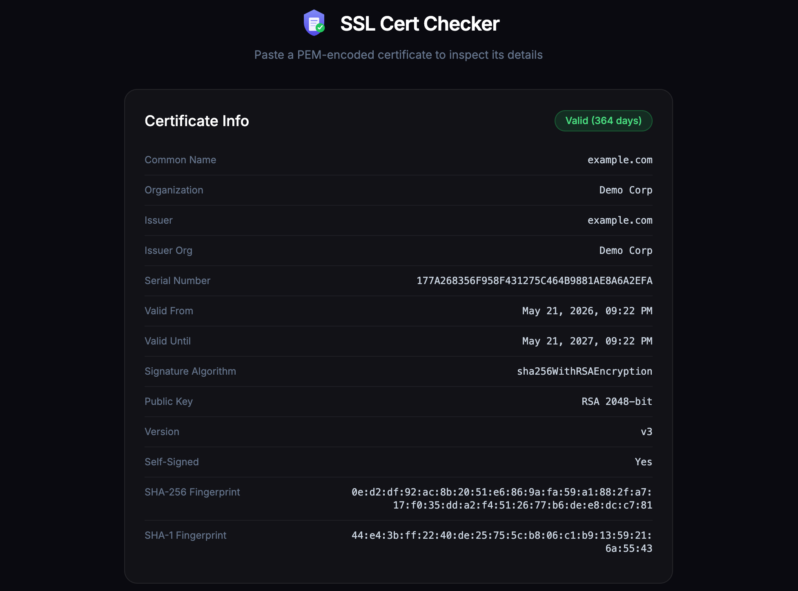

# SSL Certificate Checker

Web application that parses PEM-encoded X.509 certificates and displays their details:

- Subject & Issuer (CN, Organization, Country)
- Validity period (Not Before / Not After)
- Expiration status and days remaining
- Signature algorithm
- Public key type and size
- Subject Alternative Names (SANs)
- Extensions (Basic Constraints, Key Usage, etc.)
- SHA-256 and SHA-1 fingerprints
- Self-signed detection




## Run Locally

```bash
pip install -r requirements.txt
uvicorn app.main:app --port 8000
```

Open http://localhost:8000

## Run with Docker

```bash
docker compose up --build -d
```

## Deploy to Server (DigitalOcean)

1. Clone the repo on the server:
```bash
git clone <repo-url> && cd SSHCertChecker
```

2. Enable the post-merge hook for auto-rebuild on pull:
```bash
git config core.hooksPath hooks
```

3. Start the app:
```bash
docker compose up --build -d
```

After this, every `git pull` will automatically rebuild and restart the container.
